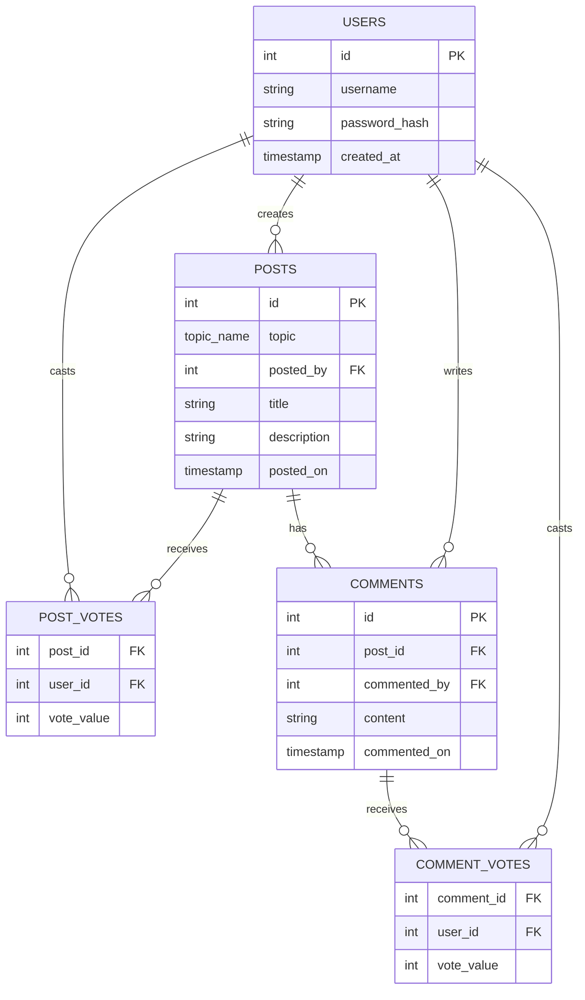

# TalkSpace

This repo contains the source code for [**TalkSpace**](https://talkspace-cvwo.netlify.app/), a web forum inspired by [Reddit](https://www.reddit.com/) that allows users to post content, comment, and vote on submissions (posts and comments). Each post must adhere to a certain topic (Technology, art, science...). In an effort to make the content accessible to all, TalkSpace does not require users to create an account or log in to view posts and comments. However, one does need an account to create posts, comment, and vote.

## Code Structure

This is a monorepo containing the client code in the `client/` directory and the server code in the `server/` directory.

## Client

The client-facing website is built using [React](https://react.dev/) (with [Vite](https://vite.dev/)) and TypeScript. It handles the user interface, enabling users to interact with the forum, create posts, comment, and vote etc. Major libraries/technologies used include:

- [React Router](https://reactrouter.com/) for routing and navigation
- [Axios](https://axios-http.com/) for making HTTP requests to backend
- [TanStack Query](https://tanstack.com/query/latest) for data fetching and state management
- [Tailwind CSS](https://tailwindcss.com/) for easy styling
- [Material UI (MUI)](https://mui.com/) for premade UI components
- [React Hook Form](https://react-hook-form.com/) for form handling (login, signup, post/comment creation/editing)
It communicates with the server via RESTful API endpoints.

### File Structure

```text
client/
├── public/                
│   └── _redirects      # For Netlify to redirect all routes to index.html, for SPA structure to work (React Router handles routing)
├── src/
│   ├── components /
│   │   ├── auth/         # Authentication components (login, register pages, handler functions)
│   │   ├── new/     # New post/comment creation components
│   │   ├── post/        # Post-related components (post display page)
│   │   ├── topic/      # Topic-related components (page where all posts under a topic are displayed)
│   │   ├── voting/      # Voting-related components (upvote/downvote + vote count display)
│   │   └── Other files (Generic error and loading components, home page, main layout container, navbar, 404 page)
│   ├── hooks/            # Custom React hooks (useFetch (an abstraction on top of useQuery from TanStack Query), useUser (gets identity of user, if logged in))
│   ├── App.tsx        # Main app component where routes are defined
│   ├── main.tsx     # Entry point
│   ├── types.ts     # Type definitions
│   ├── config.ts     # Configuration settings (axios instance etc)
│   ├── utils.ts     # Utility functions (capitalise, format date etc)
│   └── index.css     # Global CSS styles (just imports Tailwind CSS for now)
├── package.json        # Specifies dependencies
└── other config files (vite config, TS config, ESLint config...)
```

### Routes

- `/` - Home page displaying a list of topics
- `/:topic` - Displays all posts under the specified topic (+ create new post form, if logged in)
- `/:topic/:postId` - Displays specific post and its comments (+ create new comment form, if logged in)
- `/auth` - Login page
- `/auth/register` - Registration page

## Server

The backend server is a [Gin](https://gin-gonic.com/en/) (Golang) application. Every endpoint exposed starts with `/api`. It handles user authentication, post and comment CRUD functions, and voting functionality. It exposes RESTful API endpoints requested by the client.

### Authentication

Authentication is handled using Json Web Tokens (JWTs) using HTTP-Only Cookies for storage. Upon successful login/registration, the server generates a JWT using the user's username and ID (and a secret key) and sends it to the client. The client includes this JWT in every subsequent request to authenticate the user. The server uses the same secret key to verify the JWT and extract user information.

#### Authentication Endpoints

- `POST /api/login` - Logs in a user. The client sends the user's username and password in the request body. The server compares the *hashed* password with the stored hash in the database. If it matches, a JWT is generated and sent back to the client with a status code of 200 (success). If not, a 401 (unauthorized) status code is returned.
- `POST /api/register` - Registers a new user. The client sends the desired username and password in the request body. The server hashes the password and attempts to store the new user in the database. If a user with the same username already exists, a 409 (conflict) status code is returned. This is automatic because the username field is set to be unique in the database (see below). If registration is successful, a JWT is generated in the same way as above and sent back to the client with a status code of 200 (success).
- `POST /api/logout` - Logs out a user by invalidating the JWT cookie.
- `GET /api/check-auth` - Checks if the user is authenticated by verifying the JWT cookie (this is called by `useUser` on the client, see above). If valid, returns user information with status code 200 (success). If not, returns a 401 (unauthorized) status code.

### Middleware

The backend utilises 3 different middleware functions:

- `middleware.TimeOutMiddleware()` - Sets a 3 second timeout for each request. If the request takes longer than this, it is aborted. This is to prevent long requests from hanging the server, and also to improve UX by ensuring requests are responded to quickly.
- `middleware.SoftAuthMiddleware()` - Checks for the presence of a valid JWT cookie. If present and valid, it extracts user information and attaches it to the request context with a `isAuthenticated=true` flag. If not present or invalid, it **allows the request to proceed** without user information (and sets `isAuthenticated=false`).
- `middleware.HardAuthMiddleware()` - Same as SoftAuthMiddleware, but if the JWT cookie is not present or invalid, it **aborts the request** and returns a 401 (unauthorized) status code.

The purpose of having two different authentication middleware functions is to enable both protected and unprotected routes. For example, creating/editing/deleting a post/comment or voting (downvote/upvote) requires the user to be authenticated (HardAuthMiddleware), whereas simply viewing posts/comments does not (SoftAuthMiddleware). However, if the user is authenticated, we still want their identity so we can display the appropriate UI (show edit/delete buttons for their own posts/comments, and also highlight their vote direction). This matches Reddit's functionality (one does not need an account to view information, but having an account enhances their experience).

### Other Endpoints

- `GET /api/posts/:topic` - Retrieves all posts under the specified topic, including the number of comments, votes (num of upvotes - num of downvotes), and the user's vote (if authenticated) for each post. Uses soft authentication.
- `POST /api/posts` - Creates a new post. Requires hard authentication.
- `PATCH /api/posts` - Edits an existing post. Requires hard authentication.
- `DELETE /api/posts` - Deletes an existing post. Requires hard authentication.
- `GET /api/comments/:postId` - Retrieves all comments under the specified post, including the number of votes (num of upvotes - num of downvotes), and the user's vote (if authenticated) for each comment. Uses soft authentication.
- `POST /api/comments` - Creates a new comment. Requires hard authentication.
- `PATCH /api/comments` - Edits an existing comment. Requires hard authentication.
- `DELETE /api/comments` - Deletes an existing comment. Requires hard authentication.
- `POST /api/vote` - Casts/updates/removes a vote (upvote/downvote) on a post or comment. Requires hard authentication.

## Database

The project uses a [PostgreSQL](https://www.postgresql.org/) relational database to store user, post, comment and vote data. The database schema is as follows. If the diagram is not rendering, make sure your markdown viewer supports [Mermaid](https://mermaid.js.org/) diagrams.

**NOTE: The postgres database hosted on Render expires on 14/2/2026 due to free tier constraints. The site may not function properly from that date onwards.**



## Deployment

The application is currently deployed on [Netlify](https://www.netlify.com/) (client) and [Render](https://render.com) (server). The PostgreSQL database is also hosted on Render.

## Future Improvements

This project is still largely a work in progress and many features (especially UI/UX) have not been fully polished. Potential future improvements (from most to least important) include:

- UI touch ups, Dark mode and mobile responsiveness
- Search bar to search for posts and comments by keywords
- User profiles to view a particular user's posts and comments
- Ability to comment on comments (nested comments, like in reddit)

## AI Declaration

I hereby declare that ChatGPT and Gemini were used in the project in the following ways:

- What the most common MUI components are and how to use them (Container, Box, Button, Card, etc)
- How generic types work in TypeScript (used in useFetch)
- How generic function components work (used in GenericVoteDisplay)

- Learn how JWT-based authentication works and why HTTP-Only cookies are preferred for storing them
- Learn how to implement middleware and routes in Gin
- Learn how structs, struct tags and pointers work in Go
- Learn how generic types work in Go
- Learn what CORS is

- How to set up a local PostgreSQL database in Ubuntu
- Learn why using separate vote tables is more efficient than storing vote counts (and who casted them) in the posts/comments tables
- How subqueries work in SQL
- The order of keywords in SQL statements (WHERE, JOIN, GROUP BY, ORDER BY...) and special clauses like ON CONFLICT, CASE WHEN etc

- How Mermaid syntax works in markdown

- How to migrate a local PostgreSQL database to a cloud-hosted one

Last updated: 15/1/2026
